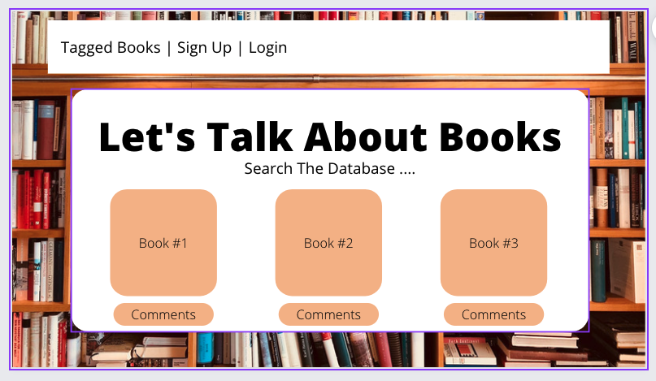
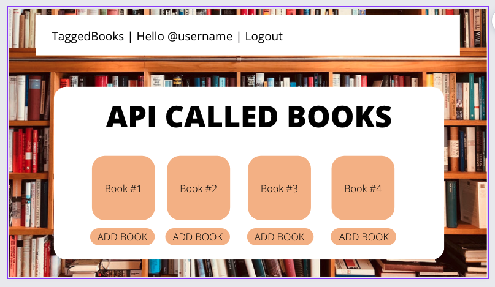
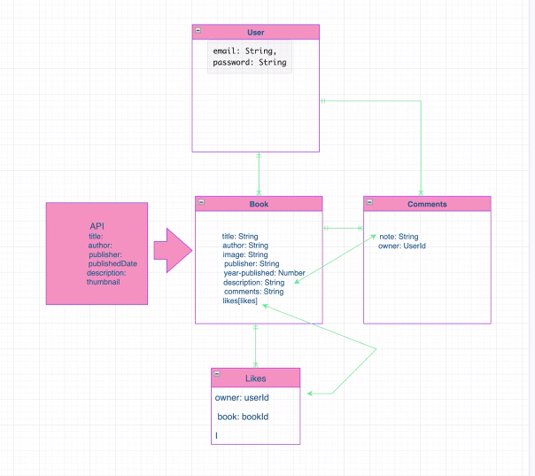

<<<<<<< HEAD
yuntian testing push

# express-auth-template
=======
# LETS TALK ABOUT BOOKS!!
>>>>>>> d89522879cc84ad9de530af4a70241ee7d0c7b9a

### PROJECT PROMPT
A full-stack application utilizing React(front-end) and Express(back-end) for users to start and join conversations about books. 

### USER STORY
1. Unregistered user will be able to navigate to book index (Tagged Books) as home page
2. Unregistered user will be able to sign up(register) using their email
3. Unregistered user can search books, but not Tag them, comment, or like, until login
4. Unregistered user will be able to click on any book on home page (Tagged Books) and go to a show page of that book
5. Unregistered user will be able to enter a book title in a search box and view a show page of the searched book
6. Unregistered user will get feedback saying their search is invalid if they type in an invalid title to a book
7. Unregistered user can view any other credentialed user’s comments from a book’s show page
8. Registered user will be able to sign in
9. Credentialed user will be able to sign out
10. Credentialed user will be able to click on any book on Tagged Books and go to a show page of that book
11. Credentialed user will be able to enter a book title in a search box and view a show page of the searched book
Credentialed user will get feedback saying their search is invalid if they type in an invalid title to a book
12. Credentialed user can add any searched book to the index page with the click of an “Tag” button
13. Credentialed user can choose to delete their own book they added from the via the book’s show page
14. Credentialed user can post comments about a book from the book’s show page
15. Credentialed user can view any other credentialed user’s comments from a book’s show page
16. Credentialed user can delete their own comments from a book’s show page
17. Credentialed user can edit their own past comments on a book’s show page
18. Credentialed user will be redirected to “Tagged Books” page upon login

<<<<<<< HEAD
1. [Download](../../archive/master.zip) this template.
1. Move the .zip file to your `sei/projects/` directory and Unzip it (creating a
   folder) -- **NOTE:** if the folder was already unzipped, use the `mv` command
   line to move it to the `sei/projects/` directory.
1. Rename the directory from express-auth-template -> your-app-name.
1. Rename [`README.md`](README.md) to `REF.md` and use as a reference, create a new README and fill with your own content.
1. Move into the new project and `git init`.
1. Replace all instances of `'express-auth-template'` with your app name.
1. Install dependencies with `npm install`.
1. Ensure that you have `nodemon` installed by running `npm install -g nodemon`.
1. Once everything is working, make an initial commit.
=======
### WIRE FRAMES
>>>>>>> d89522879cc84ad9de530af4a70241ee7d0c7b9a







### ERD (entity relationship diagram)


### API
##### GOOGLE BOOKS
##### "https://developers.google.com/books/"

### CREATED BY:
| Role | Name |
| -----|------|
| Team Manager | Ariana Briceno |
| Front End SME | Casey Jones |
| Back End SME(s) | Terrance Wells & Yuntian Zheng |

<<<<<<< HEAD
The `config` directory holds just `db.js`, which is where you specify the name
and URL of your database.

The `lib` directory is for code that will be used in other places in the
application. The token authentication code is stored in `lib/auth.js`. The
other files in `lib` deal with error handling. `custom_errors.js` is where all
the different custom classes of errors are created. If you need some other kind
of error message, you can add it here. There are also some functions defined
here that are used elsewhere to check for errors. `lib/error_handler.js` is a
function that will be used in all your `.catch`es. It catches errors, and sets
the response status code based on what type of error got thrown.

You probably will only need to interact with files in `app/models`,
`app/routes`, and `server.js`. You'll need to edit `db/config.js` just once,
to change the name of your app.

## API

Use this as the basis for your own API documentation. Add a new third-level
heading for your custom entities, and follow the pattern provided for the
built-in user authentication documentation.

Scripts are included in [`curl-scripts`](curl-scripts) to test built-in actions. Feel free to use Postman for testing, using the curl scripts listed below and in the folder for setting up headers and request bodies.
Add your own scripts to test your custom API.

### Authentication

| Verb   | URI Pattern         | Controller#Action |
| ------ | ------------------- | ----------------- |
| POST   | `/sign-up`          | `users#signup`    |
| POST   | `/sign-in`          | `users#signin`    |
| PATCH  | `/change-password/` | `users#changepw`  |
| DELETE | `/sign-out/`        | `users#signout`   |

#### POST /sign-up

Request:

```sh
curl --include --request POST http://localhost:8000/sign-up \
  --header "Content-Type: application/json" \
  --data '{
    "credentials": {
      "email": "an@example.email",
      "password": "an example password",
      "password_confirmation": "an example password"
    }
  }'
```

```sh
curl-scripts/sign-up.sh
```

Response:

```md
HTTP/1.1 201 Created
Content-Type: application/json; charset=utf-8

{
"user": {
"id": 1,
"email": "an@example.email"
}
}
```

#### POST /sign-in

Request:

```sh
curl --include --request POST http://localhost:8000/sign-in \
  --header "Content-Type: application/json" \
  --data '{
    "credentials": {
      "email": "an@example.email",
      "password": "an example password"
    }
  }'
```

```sh
curl-scripts/sign-in.sh
```

Response:

```md
HTTP/1.1 200 OK
Content-Type: application/json; charset=utf-8

{
"user": {
"id": 1,
"email": "an@example.email",
"token": "33ad6372f795694b333ec5f329ebeaaa"
}
}
```

#### PATCH /change-password/

Request:

```sh
curl --include --request PATCH http://localhost:8000/change-password/ \
  --header "Authorization: Bearer $TOKEN" \
  --header "Content-Type: application/json" \
  --data '{
    "passwords": {
      "old": "an example password",
      "new": "super sekrit"
    }
  }'
```

```sh
TOKEN=33ad6372f795694b333ec5f329ebeaaa curl-scripts/change-password.sh
```

Response:

```md
HTTP/1.1 204 No Content
```

#### DELETE /sign-out/

Request:

```sh
curl --include --request DELETE http://localhost:8000/sign-out/ \
  --header "Authorization: Bearer $TOKEN"
```

```sh
TOKEN=33ad6372f795694b333ec5f329ebeaaa curl-scripts/sign-out.sh
```

Response:

```md
HTTP/1.1 204 No Content
```
=======
##### STRETCH GOALS
- auto completing search box that provides suggestions as the user input changes
>>>>>>> d89522879cc84ad9de530af4a70241ee7d0c7b9a
